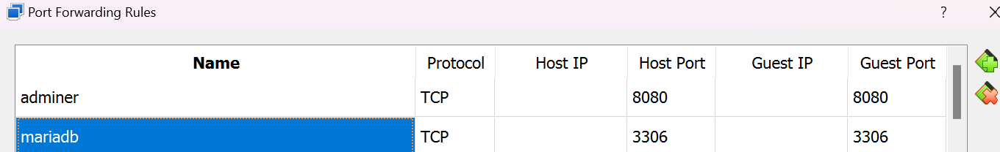

Autor: Kevin Andres Arias Fragozo

Objetivo: Implementar cliente adminer conectado con Base de datos MariaDb utilizando docker compose

# Configuración del docker-compose.yml

```yml
version: '3.8'

services:
  mariadb:
    image: mariadb:11
    container_name: my-mariadb-container
    environment:
      MARIADB_USER: ${MARIADB_USER}
      MARIADB_PASSWORD: ${MARIADB_PASSWORD}
      MARIADB_ROOT_PASSWORD: ${MARIADB_ROOT_PASSWORD}
      MARIADB_DATABASE: ${MARIADB_DATABASE}
    ports:
      - "3306:3306"
    networks:
      - mariadb_network
    volumes:
      - mariadb_data:/var/lib/mysql
    env_file:
      - .env

  adminer:
    image: adminer
    container_name: adminer-container
    restart: always
    ports:
      - "8080:8080"  
    depends_on:
      - mariadb
    networks:
      - mariadb_network

volumes:
  mariadb_data:

networks:
  mariadb_network:
```
Para definir las variables de entorno haga una copia del archivo .env.example y asigne valores a cada una de las variables.

Para esta configuración se utilizaron las siguientes variables de entorno:
- POSTGRES_USER: Esta variable de entorno nos sirve para ....
- POSTGRES_PASSWORD
- MARIADB_USER: Usuario que va a tener la base de datos.
- MARIADB_PASSWORD: Contraseña que va a tener la base de datos.
- MARIADB_ROOT_PASSWORD: Contraseña del usuario ROOT que va a tener la base de datos.
- MARIADB_DATABASE: Nombre de la base de datos.

Se configuro la red mariadb_network para conectar los sevicios de adminer y mariadb.

Se configuro el volumes mariadb_data

Se configuraron los puertos.

Para adminer.
 - "8080:8080" 

Para mariadb.
- "3306:3306"

Se agrego el parametro env_file para leer las variables de entorno del archivo .env.

# Como implementar el proyecto
ejecute el siguiente comando para implementar los servicios
```shell
docker-compose up -d
```


verifique que los contenedores esten en ejecucion
```
docker-compose ps
```


# conexión con el cliente
Si esta en virtualbox, puede configurar el reenvio de puertos de la siguiente manera:

Para que este ajuste funcione se tiene que habilitar los puertos mencionados anteriormente y que se puede visualizar en la imagen atravez del utilitario UFW.



En la imagen se evidencia la correcta configuración para el reenvio de puertos entre el host y la maquina
virtual.

abrir el navegador en el puerto configurado e inicie sesión.


realice la conexión al servidor utilizando el nombre del contenedor, username, password y nombre de la base de datos configurados en las variables de entorno.

conexión exitosa a la base de datos


