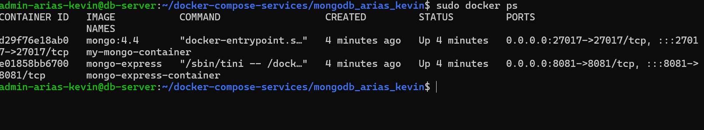
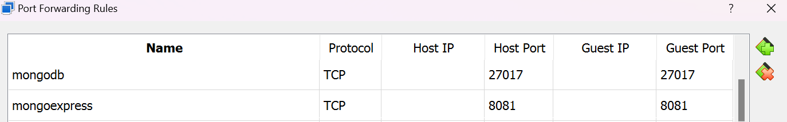

Autor: Kevin Andres Arias Fragozo

Objetivo: Implementar cliente mongo-express conectado con Base de datos Mongo utilizando docker compose

# Configuración del docker-compose.yml

```yml
version: '3.8'

services:
  mongodb:
    image: mongo:4.4
    container_name: my-mongo-container
    ports:
      - "27017:27017"
    networks:
      - mongo_network
    volumes:
      - mongo_data:/data/db
    environment:
       MONGO_INITDB_ROOT_USERNAME: ${MONGO_INITDB_ROOT_USERNAME}
       MONGO_INITDB_ROOT_PASSWORD: ${MONGO_INITDB_ROOT_PASSWORD}

  mongo-express:
    image: mongo-express
    container_name: mongo-express-container
    environment:
      ME_CONFIG_MONGODB_SERVER: mongodb
      ME_CONFIG_MONGODB_PORT: 27017
      ME_CONFIG_MONGODB_ADMINUSERNAME: ${MONGO_INITDB_ROOT_USERNAME}
      ME_CONFIG_MONGODB_ADMINPASSWORD: ${MONGO_INITDB_ROOT_PASSWORD}
    ports:
      - "8081:8081"
    networks:
      - mongo_network

networks:
  mongo_network:

volumes:
  mongo_data:
```
Para definir las variables de entorno haga una copia del archivo .env.example y asigne valores a cada una de las variables.

Para esta configuración se utilizaron las siguientes variables de entorno:
- MONGO_INITDB_ROOT_USERNAME: Usuario ROOT de mi mongodb
- MONGO_INITDB_ROOT_PASSWORD: Password ROOT de mi mongodb
- ME_CONFIG_MONGODB_SERVER: Nombre del servidor a utilizar
- ME_CONFIG_MONGODB_PORT: Puerto de mi mongodb
- ME_CONFIG_MONGODB_ADMINUSERNAME: Usuario ROOT de mi mongodb para mongoExpress 
- ME_CONFIG_MONGODB_ADMINPASSWORD: Password ROOT de mi mongodb para mongoExpress


Se configuro la red:
-  mongo_network para conectar los sevicios de mongoExpress y mongodb.

Se configuro el volumes: 
- mongo_data para la persistencia de datos

Se configuraron los puertos.

Para mongo-express.
 - "8081:8081" 

Para mongodb.
- "27017:27017"

Se agrego el parametro env_file para leer las variables de entorno del archivo .env.

# Como implementar el proyecto
ejecute el siguiente comando para implementar los servicios
```shell
docker-compose up -d
```


verifique que los contenedores esten en ejecucion
```
docker-compose ps
```




# Conexión con el cliente
Si esta en virtualbox, puede configurar el reenvio de puertos de la siguiente manera:

Para que este ajuste funcione se tiene que habilitar los puertos mencionados anteriormente y que se puede visualizar en la imagen atravez del utilitario UFW.



En la imagen se evidencia la correcta configuración para el reenvio de puertos entre el host y la maquina
virtual.

Abrir el navegador en el puerto configurado e inicie sesión.


Realice la conexión al servidor utilizando el nombre del contenedor, username, password configurados en las variables de entorno.

Conexión exitosa a la base de datos


